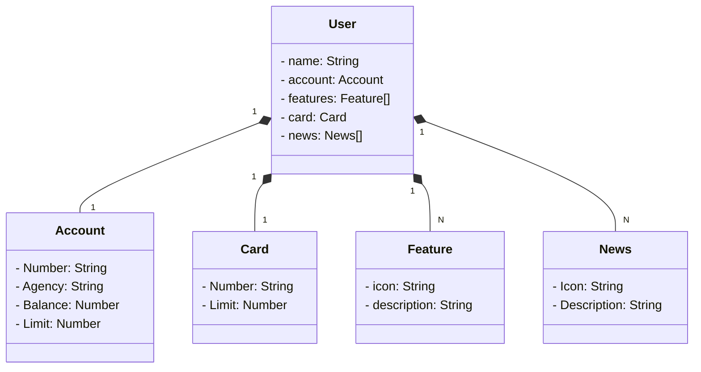

# Santander dev work 2023
Java RESTful criada para a Santander Dev Week.

## Diagrama de Classe

```mermaid 
classDiagram
  class User {
    - name: String
    - account: Account
    - features: Feature[]
    - card: Card
    - news: News[]
  }

  class Account {
    - Number: String
    - Agency: String
    - Balance: Number
    - Limit: Number
  }

  class Card {
    - Number: String
    - Limit: Number
  }

  class Feature {
    - icon: String
    - description: String
  }

  class News {
    - Icon: String
    - Description: String
  }

  User "1" *-- "1" Account
  User "1" *-- "1" Card
  User "1" *-- "N" Feature
  User "1" *-- "N" News
```
